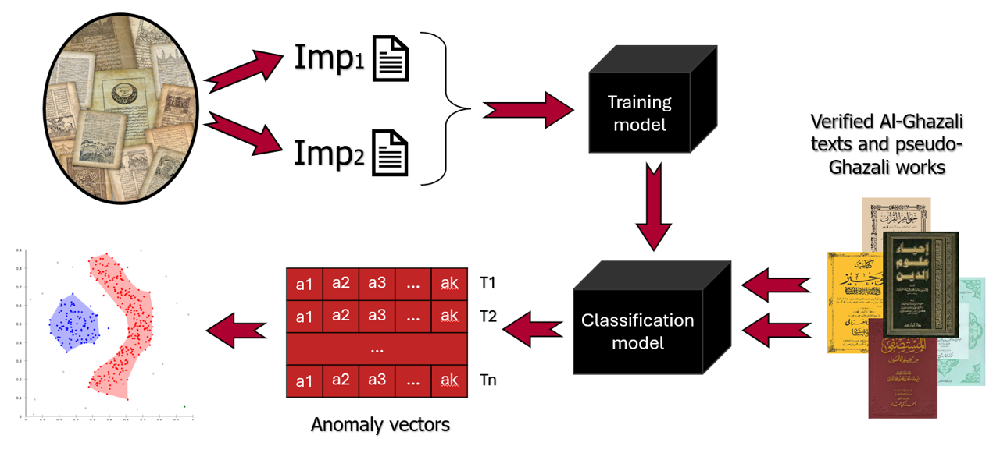
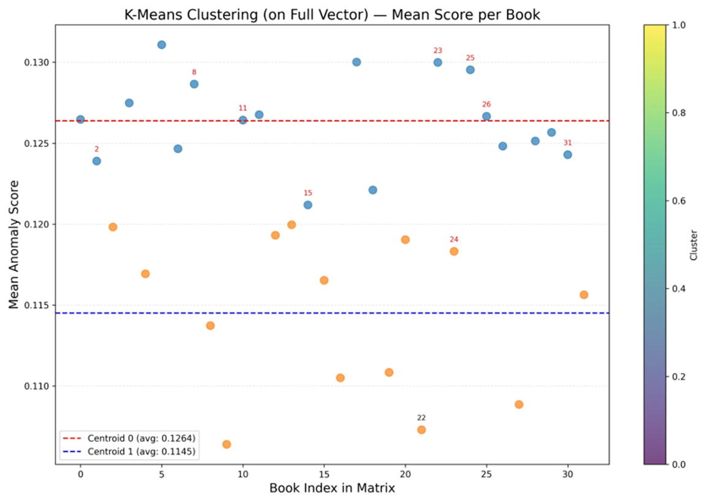
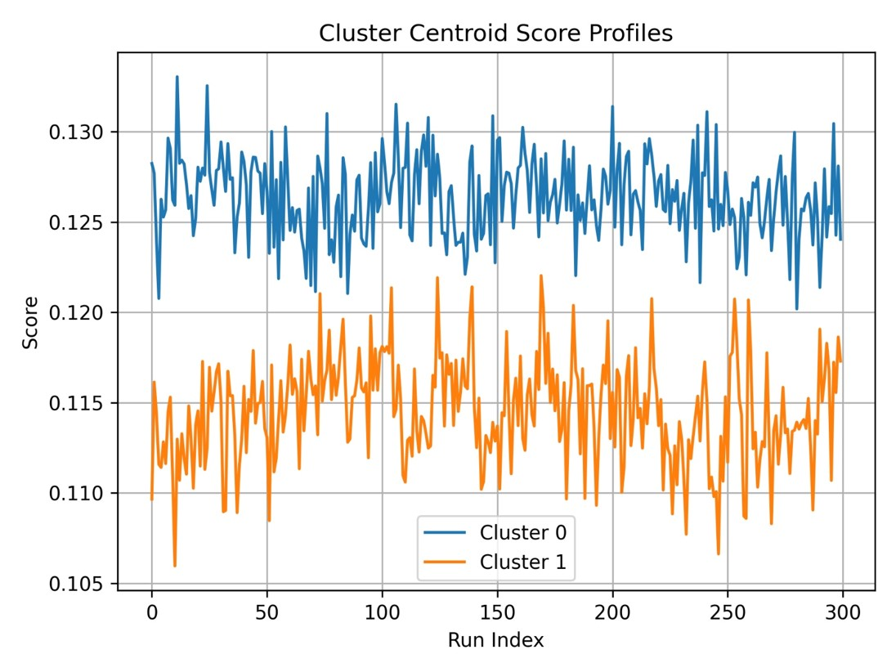
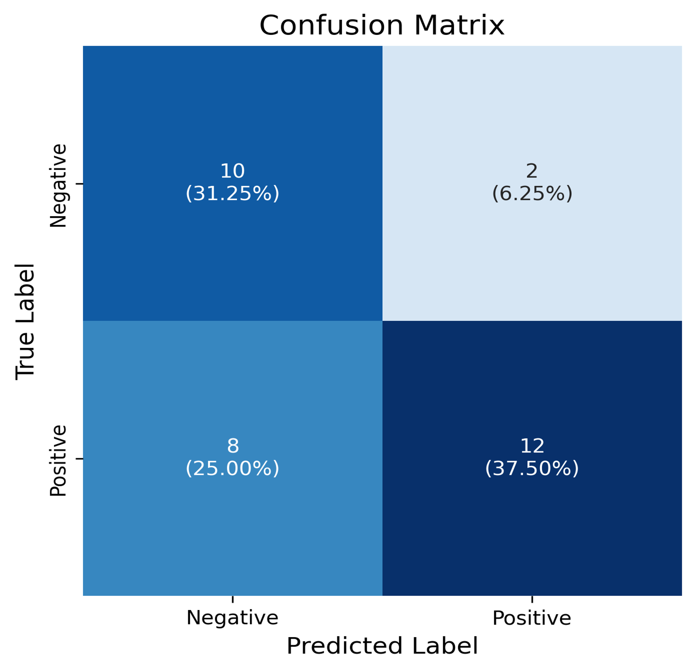

# Analysis of Medieval Arabic Creations

---

## 📘 Introduction & Problem Definition

**Authorship attribution** in medieval Arabic texts presents unique linguistic and computational challenges.  
The rich morphological structure, stylistic variation, and inconsistent orthography found in historical manuscripts make it difficult to determine whether a work was genuinely authored by the individual to whom it is attributed.

This issue is especially critical in the case of **Abu Hamid Al-Ghazali**, a central figure in Islamic thought, whose corpus contains numerous texts with debated authenticity.

Traditional authorship verification methods often rely on **manual stylistic analysis**, lacking the objectivity and scalability required for evaluating large and diverse text collections.  
This highlights the need for **automated, reproducible, data-driven tools** that provide insight into textual authorship.

---

### 🎯 Project Goal

To design a **computational framework** for distinguishing **authentic** from **pseudo-attributed** texts —  
even when **labeled data is unavailable**.

This solution must:
- Scale to large historical corpora  
- Adapt to morphologically rich, low-resource languages like Classical Arabic  
- Offer interpretability for scholarly analysis  

While this project focuses on **Al-Ghazali's writings**, the broader goal is to enable attribution analysis **across authors and eras**.

---

## 🧪 Pipeline Overview

**1. Data Preprocessing**  
- Tokenization, stopword removal, and normalization using CAMeL Tools  
- Cleaned data grouped into:  
  - *Impostors*: 25 books (~250KB each)  
  - *Test Group*: 32 texts split into 113 files (~200KB each)

**2. Embedding with Fine-Tuned AraBERT**  
- Fine-tuned on historical texts  
- Generates 768-dim CLS embeddings per 50-word batch  

**3. Siamese Network Training**  
- CNN-BiLSTM architecture  
- Trained using contrastive loss on impostor batches  
- Learns stylistic similarity patterns  

**4. Signal Computation & Anomaly Detection**  
- Each test book produces a stylistic similarity signal  
- Signals evaluated using Dynamic Time Warping (DTW)  
- Outliers detected with Isolation Forest

**5. Clustering & Interpretation**  
- K-Means (K=2) to distinguish authentic vs disputed books  
- Reference text: *Iḥyāʾ ʿUlūm al-Dīn* (known Al-Ghazali work)

---

## 📊 Results

### 🔍 Clustering & Classification

  
  

<em>Left: K-Means Clustering (red = disputed texts, book 22 = authentic) 
Right: Cluster Profiles — Lower scores indicate higher stylistic coherence</em>

 

### 📉 Confusion Matrix

  

Each value shows the number of books and its percentage out of the full dataset (N = 32). 
<b>TP (12)</b> and <b>TN (10)</b> together account for <b>69%</b> correctly classified texts.

---

## ✅ Conclusion

The results reveal a **clear stylistic separation** between authentic and disputed texts, showing high agreement with historical scholarly classifications.  
This supports the reliability of our **signal-based, unsupervised authorship verification framework**, especially in **low-resource, morphologically complex languages** like Arabic.

---

## 🧑‍🏫 Supervisors

We would like to thank:

- **Prof. Zeev Volkovich**  
- **Dr. Renata Avros**  
for their valuable guidance and support throughout this project.

---

